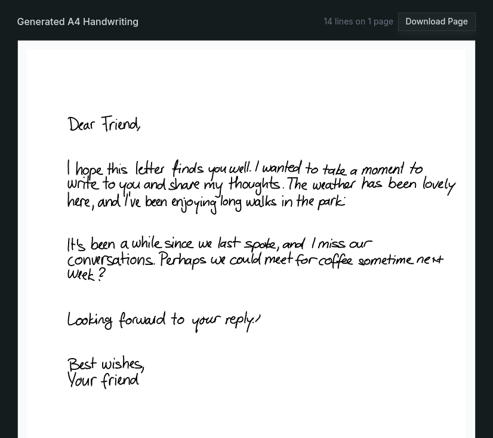
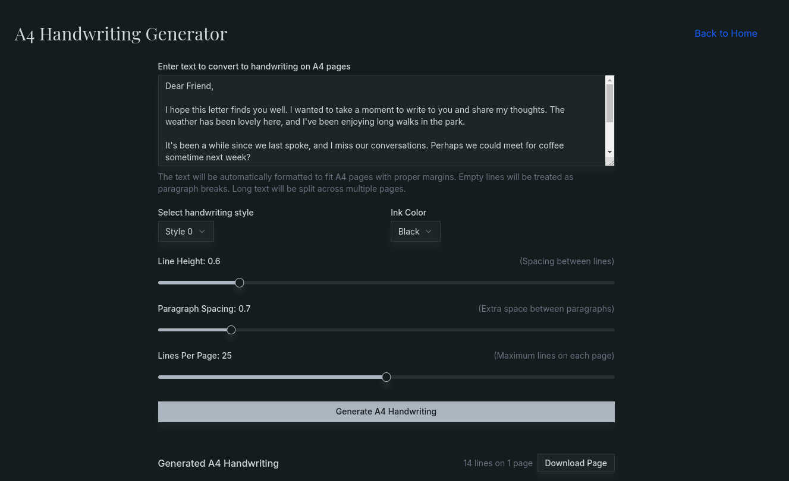

<h1 align="center">Kalam2</h1>

<p align="center">
Kalam2 is a full-stack handwriting generation application. It consists of a FastAPI backend for generating SVG handwriting using machine learning, and a Next.js frontend for user interaction and visualization.
</p>

<p align="center">
   <a href="https://www.python.org/"></a>
   <a href="https://fastapi.tiangolo.com/"></a>
   <a href="https://nextjs.org/"></a>
   <a href="https://opensource.org/licenses/MIT"></a>
</p>

<p align="center">
  
</p>

## Features

- Generate realistic handwriting in multiple styles
- Download handwriting as SVG (including A4 page layout)
- Customizable style, color, and layout options
- API endpoints for integration

<p align="center">
  
</p>

---

## Backend (FastAPI)

### Setup

1. Install [uv](https://docs.astral.sh/uv/getting-started/installation/)
2. Install dependencies and activate virtual environment:
   ```bash
   uv sync
   source .venv/bin/activate
   ```
3. Start the backend server:
   ```bash
   python main.py
   ```
   The API will be available at `http://localhost:8000/api/v1`.

### Main Endpoints

- `POST /api/v1/handwriting/generate` — Generate handwriting from text lines
- `POST /api/v1/handwriting/a4page` — Generate handwriting formatted for A4 pages
- `GET /api/v1/handwriting/styles` — List available handwriting styles
- `GET /api/v1/handwriting/styles/{style_id}` — Get details and preview for a style

---

## Frontend (Next.js)

### Setup

1. Install Node.js.
2. Install dependencies:
   ```bash
   pnpm install
   # or
   npm install
   ```
3. Start the development server:
   ```bash
   pnpm dev
   # or
   npm run dev
   ```
   The app will be available at `http://localhost:3000`.

### Usage

- Enter text and select a handwriting style to generate handwriting.
- Use the A4 page generator for multi-page output.
- Download generated SVGs for use in documents or printing.

---

## Deployment

- The frontend can be deployed on Vercel or any static hosting supporting Next.js.
- The backend can be deployed on any server supporting Python and FastAPI.

---

## License

MIT License

---

## Acknowledgements

- Built with FastAPI, Next.js, and TensorFlow.
- Handwriting model and styles are from https://github.com/sjvasquez/handwriting-synthesis.
